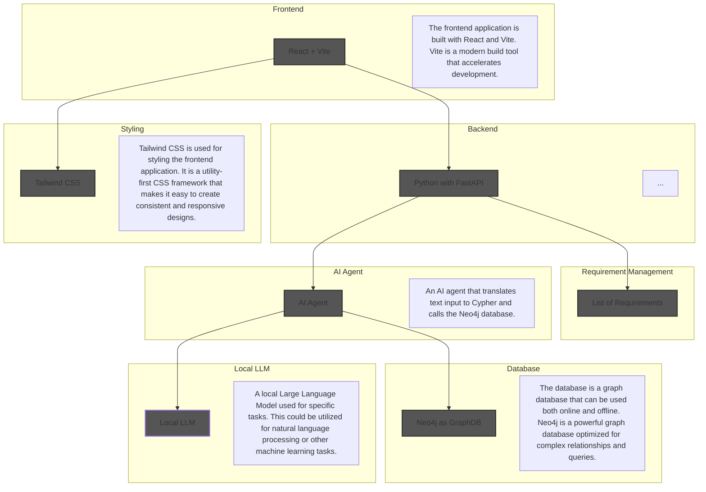

# poc-archi-to-neo4j-to-app
This system architecture, implemented as a proof of concept, integrates a modern frontend built with React, Vite, and Tailwind CSS, a high-performance backend using Python and FastAPI, and a Neo4j graph database for complex data relationships. Archimate models serve as the primary data source, with arch models exported to the Neo4j database. After the import of Archimate models to the Neo4j database, users are able to ask questions about the model through natural language, facilitated by an AI agent that translates text input into Cypher queries and the response back to natural language.

TODOs:
- https://neo4j.com/blog/genai/what-is-graphrag/
