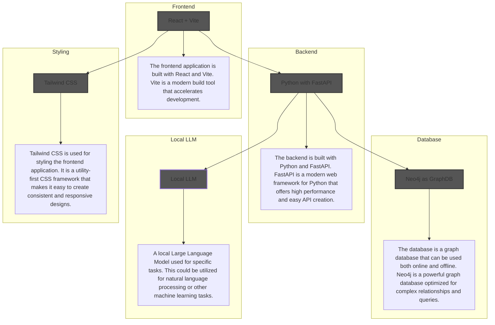

# poc-archi-to-neo4j-to-app
Proof of Concept for Archi to Neo4j in order to to use it within an App

```mermaid
graph TD
    subgraph Frontend
        A[React + Vite]
        A1[The frontend application is built with React and Vite. Vite is a modern build tool that accelerates development.]
    end

    subgraph Backend
        B[Python with FastAPI]
        B1[The backend is built with Python and FastAPI. FastAPI is a modern web framework for Python that offers high performance and easy API creation.]
    end

    subgraph Database
        C[Neo4j as GraphDB]
        C1[The database is a graph database that can be used both online and offline. Neo4j is a powerful graph database optimized for complex relationships and queries.]
    end

    subgraph Local LLM
        D[Local LLM]
        D1[A local Large Language Model used for specific tasks. This could be utilized for natural language processing or other machine learning tasks.]
    end

    subgraph Styling
        E[Tailwind CSS]
        E1[Tailwind CSS is used for styling the frontend application. It is a utility-first CSS framework that makes it easy to create consistent and responsive designs.]
    end

    A --> A1
    B --> B1
    C --> C1
    D --> D1
    E --> E1

    A --> B
    B --> C
    B --> D
    A --> E

    style A fill:#555,stroke:#333,stroke-width:2px
    style B fill:#555,stroke:#333,stroke-width:2px
    style C fill:#555,stroke:#333,stroke-width:2px
    style D fill:#555,stroke-width:2px
    style E fill:#555,stroke:#333,stroke-width:2px
```
